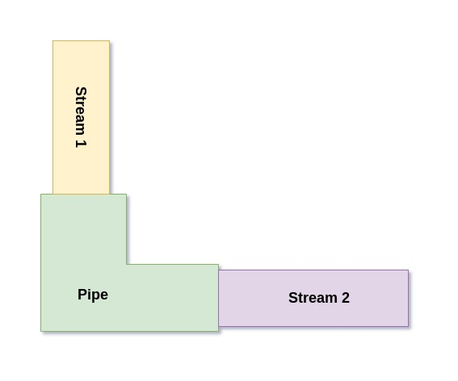
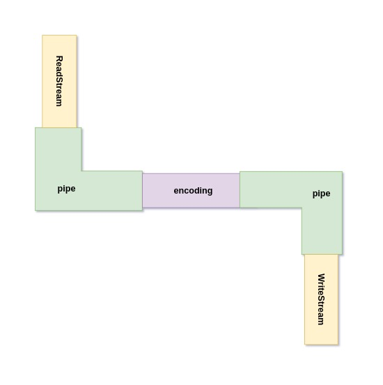
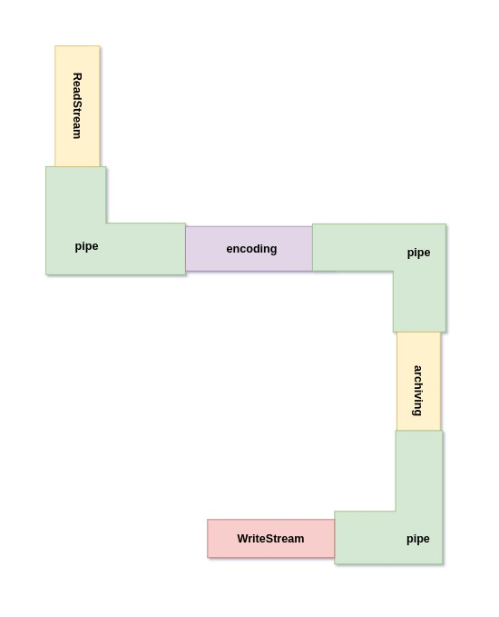

## Jeden strumień odczytu, dwa strumienie zapisu

W pliku 'twoStreams.js' stwórz strumień odczytu z pliku 'input.txt'. Następnie stwórz dwa strumienie zapisu. Jeden z nich niech zapisze dane to pliku 'output.txt'. Drugi niech zapisze go do 'output2.txt'.

## Komendy do uruchomienia:
Aby uruchomić program wpisz:
```bash
node twoStreams
```
Jeśli chcesz aby program się uruchomił w trybie _watch_ (program będzie uruchamiany za każdym razem kiedy zostanie zmieniony i zapisany) wpisz:
```bash
npm install
```
aby zainstalować zależności z pliku package.json. A następnie:
```bash
npm run start:twoStreams
```
Aby wyjść z trybu watch wciśnij Ctrl + C.

## Pipe

Napewno zauważyłaś/zauważyłeś, że przekazywanie danych z jednego strumienia do drugiego jest bardzo często spotykane. Do tego została stworzona funkcja .pipe(). Jak nazwa wskazuje służy ona do przekazywania wyników z jednego strumienia do kolejnego. Otwórz plik 'pipe.js'. Przeanalizuj kod a następnie uruchom program.



## Komendy do uruchomienia:
Aby uruchomić program wpisz:
```bash
node pipe
```
Jeśli chcesz aby program się uruchomił w trybie _watch_ (program będzie uruchamiany za każdym razem kiedy zostanie zmieniony i zapisany) wpisz:
```bash
npm install
```
aby zainstalować zależności z pliku package.json. A następnie:
```bash
npm run start:pipe
```
Aby wyjść z trybu watch wciśnij Ctrl + C.


## Szyfrowanie w strumieniu

Przejdźmy do czegoś bardziej zaawansowanego. W pliku 'encode.js' napisz program który odczyta dane z pliku 'input.txt', zaszyfruje je, a następnie zapisze w pliku 'output.encoded.txt'. Funkcja szyfrująca jest już gotowa. Skorzystaj z funkcji pipe.



## Kilka słów o metodzie createCipher()
Funkcja createCipher(algorithm, secretKey) zwraca funkcję, którą można zaszyfrować tekst. Aby odszyfrować zaszyfrowany tekst należy stworzyć funkcję deszyfrującą createDecipher(algorithm, secretKey). Więcej informacji na temat modułu crypto znajdziesz w [dokumentacji](https://nodejs.org/api/crypto.html). Poniżej przykład użycia:

```javascript
const crypto = require('crypto')
const fs = require('fs')

const functionThatMakesTextSecret = crypto.createCipher('aes256', 'aSecretKey')
const functionThatMakesTextNotSecret = crypto.createDeciper('aes256', 'aSecretKey')

fs.createReadStream(__dirname + '/pathToFile')
    .pipe(functionThatMakesTextSecret)
    .pipe(fs.createWriteStream(__dirname + 'pathToFile.secret'))
```

## Komendy do uruchomienia:
Aby uruchomić program wpisz
```bash
node encode
```
Jeśli chcesz aby program się uruchomił w trybie _watch_ (program będzie uruchamiany za każdym razem kiedy zostanie zmieniony i zapisany) wpisz:
```bash
npm install
```
aby zainstalować zależności z pliku package.json. A następnie:
```bash
npm run start:encode
```
Aby wyjść z trybu watch wciśnij Ctrl + C.


## Szyfrowanie i archiwizowanie - zadanie dodatkowe

W pliku 'encodeAndZip.js' napisz program, który odczyta strumieniowo plik 'input.txt', a następnie w jednym strumieniu wyjściowym zaszyfruje dane, a następnie je zarchiwizuje  i zapisze do pliku output.archived.zip. Odwróć ten proces programem, który napiszesz w pliku 'unzipAndDecode.js'.



## Komendy do uruchomienia:
Aby uruchomić program encode wpisz:
```bash
    node encode
```
Jeśli chcesz aby program się uruchomił w trybie _watch_ (program będzie uruchamiany za każdym razem kiedy zostanie zmieniony i zapisany) wpisz:
```bash
    npm install
```
aby zainstalować zależności z pliku package.json. A następnie:
```bash
    npm run start:encode
```

Aby wyjść z trybu watch wciśnij Ctrl + C.
Dokładnie tak samo uruchomisz plik decode.


## Ascii, base64, utf-8 - zadanie dodatkowe

W pliku encoding.js znajduje się zmienna message. Odkoduj tę wiadomość korzystając z 'base64', a następnie zapisz ją strumieniem do pliku 'target.utf.txt w kodowaniu utf-8 oraz do pliku target.ascii.txt przy użyciu kodowania ascii.

## Komendy do uruchomienia:
Aby uruchomić program wpisz:
```bash
npm install
```
aby zainstalować zależności z pliku package.json. A następnie:
```bash
npm run start
```
Aby wyjść z trybu watch wciśnij Ctrl + C.