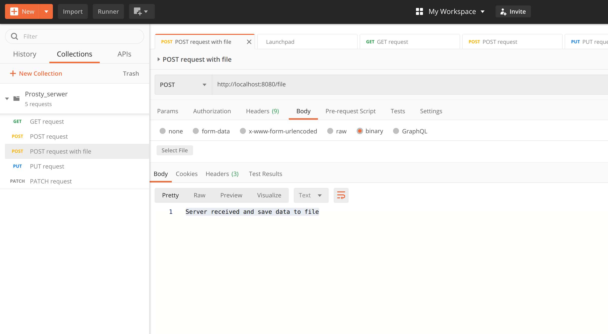
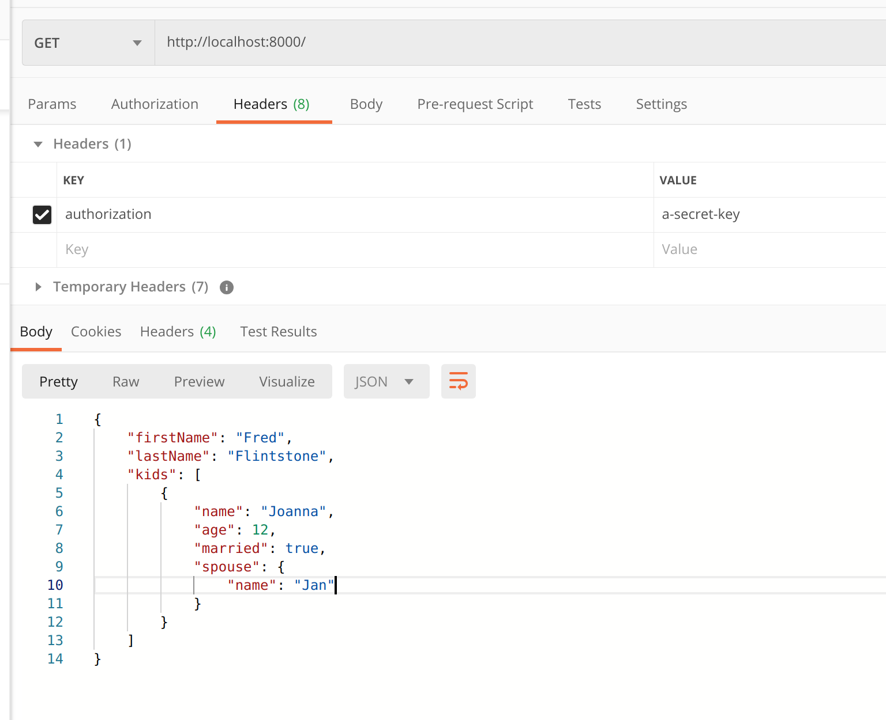

# Postman i serwer HTTP w Node.js

Celem tego zadania jest przede wszystkim poznanie aplikacji _Postman_ jako narzędzia do interakcji z aplikacjami z wykorzystaniem protokołu HTTP. Postman jest bardzo często używany i napewno spotkacie sie z nim w swojej karierze inżyniera oprogramowania.

## Krok 1

Uruchom program server.js. Wykonasz to za pomocą komendy:

```bash
npm install
npm start
```

Działający serwer wyloguje wiadomość:

```bash
Listening on port 8080
```

## Krok 2

Zainstaluj Postman'a. Aplikację można pobrać spod [tego adresu](https://www.postman.com/downloads/). Postman nie różni się w zależności od systemu operacyjnego. Następnie zaimportuj kolekcję _Prosty_serwer.postman_collection.json_, która znajduje się w tym samym folderze.

## Krok 3

Wykonaj wszystkie zapytania dostępne w kolekcji. Pobaw się kodem dostępnym w pliku _server.js_, spróbuj podmienić wiadomości, dodać warunki.

## Krok 4

Mając na uwadze to, że obiekt Request jest strumieniem, stwórz funkcjonalność, która zapisze plik przesłany przez Postman do pliku znajdującego się w tym samym folderze co plik server.js. Skorzystaj z metody **fs.createWriteStream()** oraz **pipe()**. Funkcjonalność niech będzie dostępna jeśli zapytanie będzie przesłane metodą POST pod URL http://localhost:8080/file. Niech serwer odpowie wiadomością:

```bash
Server received and save data to file
```

po zapisaniu pliku do folderu ./bootstrap.

Zapytanie jest już dostępne w kolekcji. Pamiętaj jednak aby w Postman'ie wybrać plik. Wciśnij przycisk **body**, a następnie **binary**. Wybierz jakikolwiek plik z twardego dysku. W tym celu wciśnij **Select file**, tak jak jest pokazane na obrazku 


# Axios - wysłanie zapytania GET z nagłówkiem authorization i Content-Type

Celem tego ćwiczenia jest poznanie modułu Axios. Zacznijmy od instalacji. Wykonaj komendę:

```bash
npm install axios
```

Następnie upewnij się, że moduł został poprawnie dodany do pliku _package.json_.

## Krok po kroku

W pliku server.js znajdują się dwa servery http: _Alpha_ i _Omega_. Waszym zadaniem jest następująca implementacja obu serwerów:

1. Użytkownik robi zapytanie do serwera _Alpha_ korzystając z metody *GET* załączając nagłówek:
```bash
Authorization: a-secret-key
```
2. Serwer _Alpha_ tworzy zapytanie GET do serwera _Omega_ załączając ten sam nagłówek.

3. Jeśli nagłówek _Authorization_ jest równy 'a-secret-key' serwer _Omega_ zwraca serwerowi _Alpha_ obiekt:

```javascript
{
    firstName: 'Fred',
    lastName: 'Flintstone',
    kids: [{
        name: 'Joanna',
        age: 12,
        married: true,
        spouse: {
            name: 'Jan'
        }
    }]
}
```
4. Serwer _Alpha_ dodaje nagłówek 'Content-Type: application/json' i zwraca obiekt użytkownikowi. Finalny efekt z perspektywy użytkownika jest pokazany na poniższym zrzucie ekranu:
 

5. Jeśli nagłówek nie jest równy 'a-secret-token', serwer _Omega_ zwraca odpowiedź o statusie 403. W tym przypadku, serwer _Alpha_ zwraca użytkownikowi odpowiedź o statusie 403 i przesyła tekst 'Server Omega sent an unauthorized response'.

Powodzenia!


# Wykonywanie wielu zapytań HTTP za pomocą Axios - zadanie dodatkowe

Celem tego zadania jest pokazanie możliwości wykonywania wielu akcji asynchronicznych. Te ćwiczenie jest również powtórką z metody **Promise.all()**, która była omawiana w poprzednich rozdziałach.

## Krok 1
Stwórz 4 serwery http w pliku main.js.
1. **Alpha**, port 5000
2. **Bravo**, port 6000
3. **Charlie**, port 7000
4. **Delta**, port 8000

## Krok 2
Gdy użytkownik wykona zapytanie do serwera _Alpha_, serwer _Alpha_ wykona zapytania do wszystkich pozostałych serwerów. Pozostałe serwery odpowiadają obiektem:

```javascript
{
    message: `Hello from ${serverName}`,
    timestamp: 1584051726516
}
```

Aby uzyskać **timestamp**, należy uruchomić poniższą metodę:
```javascript
new Date().getTime()
```

## Krok 3
Gdy serwer _Alpha_ uzyska odpowiedzi od serwerów _Bravo_, _Charlie_ oraz _Delta_. Zwraca je użytkownikowi jako obiekt typu JSON.

```javascript
{
  bravo: { message: 'Hello from Bravo', timestamp: 1584051726516 },
  charlie: { message: 'Hello from Charlie', timestamp: 1584051726517 },
  delta: { message: 'Hello from Delta', timestamp: 1584051726517 }
}

```


