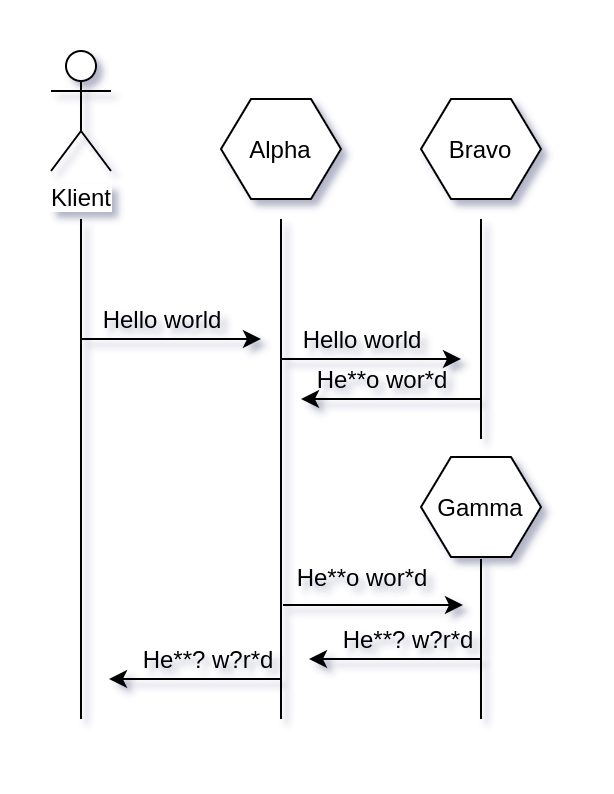

# Zmienne środowiskowe

Celem tego ćwiczenia jest nabycie umiejętności korzystania ze zmiennych środowiskowych, przy użyciu globalnego obiektu **process.env** oraz modułu **.env**.

## Krok po kroku

1. W pliku main.js znajduje się jedna funkcja. W tym momencie program wyloguje:

```
undefined
undefined
```

Wynika to z faktu, że w tym momencie zmienne środowiskowe o nazwach: **MONGO_URL**, **SUPER_SECRET_KEY** nie są zadeklarowane. Aby się upewnić, uruchom program za pomocą komendy:

```bash
node main.js
```

2. Stwórz walidację obecności powyższych zmiennych środowiskowych; program musi wyrzucić błąd w przypadku braku którejkolwiek z nich.
3. Uruchom program w taki sposób aby zmienne środowiskowe **MONGO_URL**, **SUPER_SECRET_KEY** były dostępne w **process.env**.
4. Korzystając z paczki **dotenv**, w pliku **config.js** zapewnij odczyt zmiennych środowiskowych, które są zapisane w pliku **.env**.


# Głuchy telefon

## Cele zadania
1. utrwalenie umiejętności związanych z tworzeniem zapytań **http** przy uzyciu **Axios**
2. dalsza praca nad korzystaniem ze zmiennych środowiskowych

## Wymagania dotyczące konfiguracji
W katalogu zadania znajdują się pliki:

- Alpha.js, serwer do którego zapytania będzie wysyłał klient
- Bravo.js, serwer do którego zapytania będzie wysyłał serwer Alpha
- Gamma.js, serwer do którego zapytania będzie wysyłał serwer Alpha

Aby uruchomić wszystkie serwery na raz, uruchom komendę:
```bash
npm install
npm run all
```
1. Serwery **Alpha**, **Bravo**, **Gamma** działają na portach, które są podane w pliku **.env**. Stwórz plik **config.js**, z którego będziesz eksportował obiekt konfiguracyjny zawierający informacje o portach, na których ma działać każdy z serwerów. Skorzystaj z paczki **.env**.

2. Aplikacja zwraca błąd w przypadku braku podania portu. 

## Wymagania funkcjonalne
Przebieg komunikacji jest następujący:

1. Klient wysyła do serwera **Alpha** zapytanie:
```
method: POST
body: Hello world
```
2. Serwer **Alpha** tworzy zapytanie do serwera **Bravo**. Przesyła mu body, które otrzymał od klienta. Serwer **Bravo** zamienia wszystkie znaki **l** na **"*"** i zwraca je do serwera **Alpha**.
3. Otrzymane dane serwer **Alpha** przesyła do serwera **Gamma**, który zamienia wszystkie znaki **o** na **"?"** i zwraca dane **Alpha**.
4. Na końcu, serwer **Alpha** przesyła dane do klienta.

Całość jest pokazana na diagramie sekwencji:



## Małe podpowiedzi
1. Aby zamienić znaki skorzystaj z metody .replace(regex), np:
```javascript
'Hello world'.replace((/l/g, '*'))
// He** wor*d
```

2. Pamiętaj o przekonwertowaniu body z bufora do stringa. Stwórz tę funkcjonalność w pliku bodyParser.js.


# Obsługa Content-Type

Celem tego zadania jest:

1. Utrwalenie umiejętności korzystania z nagłówków
2. Zwracanie różnych typów danych

## Słowo wstępu
Nagłówki odpowiedzi/zapytania **Content-Type** oraz **Accept** są jednymi z najbardziej istotnych. Służą one do wymiany informacji na temat tego jakiego typu danych oczekuje klient oraz jaki typ danych zwraca aplikacja. Na przestrzeni czasu istniało wiele standardów. Teraz najczęściej stosowanym jest **application/json**, szczególnie w świecie Node.js. Innym, kiedyś często stosowanym standardem jest **application/xml**.

O XML(Extensible Markup Language) więcej dowiecie się [tutaj](https://pl.wikipedia.org/wiki/XML). W telegraficznym skrócie, XML jest pewną strukturą stosowaną do przesyłania danych. W obecnie budowanych aplikacjach w środowisku Node.js, XML nie jest stosowany. Alternatywami dla XML są: JSON oraz [YAML](https://en.wikipedia.org/wiki/YAML). Często jednak jest potrzena konwersji z JSON/XML i odwrotnie, aby móc integrować się ze starszymi aplikacjami.

## Zadanie
W pliku server.js znajduje sie serwer HTTP. Założenia są następujące: Użytkownik wysyła następujące zapytanie do serwera:

```
method: POST
body: { "message": "hello world" }
Content-Type: application/json
Accept: application/json | application/xml | text/html
```

W zależności od nagłówka **Accept**, serwer zwraca te same dane tylko w innej formie.
1. Dla **application/json** zwróci dokładnie tam sam obiekt, który otrzymał:
```
{
    "message": "hello world"
}
```
2. Dla application/xml zwróci:
```
<message>hello world</message>
```
3. Dla text/html zwróci:
```
<html>
    <header>
        <h2>CodersLab</h2>
    </header>
    <body>
        <p>hello world</p>
    </body>
</html>
```
4. Dla każdej innej wartości nagłówka **Accept** serwer zwraca status **404** i wiadomość:
```
Accepted Content-Type is not supported.
```

## Krok po kroku
1. W pierwszej kolejności należy zaimplementować parsowanie body. Dla przypomnienia, obiekt Request jest strumieniem odczytu. Należy z tego strumienia złożyć sobie body samemu. Dla przejrzystości kodu parsowanie body może być wydzielone do odrębnego pliku np. bodyParser.js.
2. Następnie należy serwerowi umożliwić wykonywania różnych operacji w zależności od przesłanego nagłówka **Accept**. W tym kroku zaimplementujcie również zwrócenie błędu jeśli nagłówek **Accept** jest inny niż którykolwiek ze wspieranych przez serwer.
3. Natępnie należy zwrócić ten sam obiek z nagłówkiem 'Content-Type' o wartości 'application/json'.
4. Potem, niech serwer zwróci ten sam obiekt przekonwertowany do **xml**. Mała podpowiedź, aby dokonać takiej konwersji, można skorzystać z gotowej [paczki](https://www.npmjs.com/package/jsontoxml).
5. Potem, należy zaimplementować funkcję, która stworzy HTML'a w oparciu o body z obiektu request.

## Mała podpowiedź
Pamiętaj, że należy sparsować body. Odczytaj je strumieniowo z obiektu Request.
  